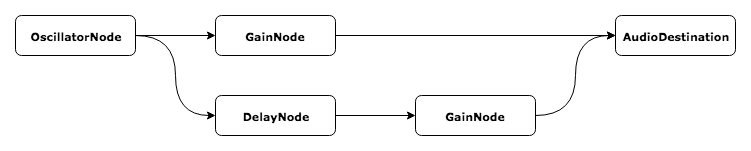

# Elm-Web-Audio

> *An elm/html-like library for the Web Audio API*.

## About
This library aims to provide a simple way of creating Web Audio processing graphs 
in elm. It was motivated by a personal belief that the audio graph could be 
considered a "view" into the model just as much as a DOM tree is.

To that end I have created this library to closely mimic the functionality of 
`elm/html`, e.g:

```
-- elm/html
div : List Attribute -> List (Html a) -> Html a

-- elm-web-audio
osc : List Property -> List Node -> Node
```

The intention being that any time your [TEA](https://guide.elm-lang.org/architecture/) 
`update` function returns `( model, Cmd.none )`, you instead send your Web Audio 
graph through a port to javascript (see the implementation section below for more 
deatils). 

What we get out of this is a highly declarative, type safe method of constructing 
Web Audio graphs. Let's create a simple example and compare a typical javascript 
approach to the elm-web-audio approach. 



The above image shows a simple signal graph, in javascript we might do something 
like this:

```javascript
const osc = context.createOscillator()
const oscGain = context.createGain()
const delay = context.createDelay()
const delayGain = context.createGain()

osc.connect(oscGain)
oscGain.connect(context.destination)
osc.connect(delay)
delay.connect(delayGain)
delayGain.connect(context.destination)
```

Here the process is split into two steps. First, we create all the nodes in our 
graph and store references to them. Then, we connect each of them in sequence. 
While perfectly servicable, this process isn't particularly scalable and soon we 
will end up with a an unmaintable mess of nodes and connections. To make matters 
worse, anyone with a reference to our nodes can mutate them whenever they want! 
In elm-web-audio we can just do:

```elm
graph : List Node
graph =
    [ osc []
        [ gain []
            [ dac ]
        , delay []
            [ gain [] 
                [ dac ]
            ]
        ]
    ]
```

Notice how the shape of the graph in elm close reflects the image above. In this 
way our code is partially self documenting and easier to understand at a glance. 
Also note how the intialisation and connection of nodes is done in place, rather 
than as two distinct steps. This makes it harder run into bugs where you forget 
to connect nodes properly, or connect the wrong nodes together.

For more complex graphs that can't be represented as a simple tree, take a look 
at the documentation for `Keyed` and `Ref` nodes. These provide a way to "jump" 
around the graph by referencing nodes elsewhere.

## Learn More
If you're new to the Web Audio API and wondering how this is any different to a 
plain old `<audio>` html element, you can check out the MDN docs 
[here](https://developer.mozilla.org/en-US/docs/Web/API/Web_Audio_API).

To see an example of this library in action, you can check out a 
[demo]() and view the [source]().

## Implementation
Currently, Elm (0.19) isn't able to interface with the Web Audio API directly. 
Instead this library was designed to be used with 
[ports](https://guide.elm-lang.org/interop/ports.html), with the *real* Web Audio 
nodes being constructed in javascript land. In the future I am planning to release 
my own personal virtual-audio library as a javascript companion to this package, 
but for now you will have to roll your own or find another solution!

The library exposes an `encode` method that will serialise a node into some sensible
JSON. An oscillator node with a frequency of 440hz, for example, would be encoded 
as:

```json
{
    "type": "OscillatorNode",
    "properties": [
    {
        "type": "AudioParam",
        "label": "frequency",
        "value": 440
    }
    ],
    "connections": []
}
```

You can refer to the documentation for `encode` for a more detailed breakdown of 
how everything is encoded. 